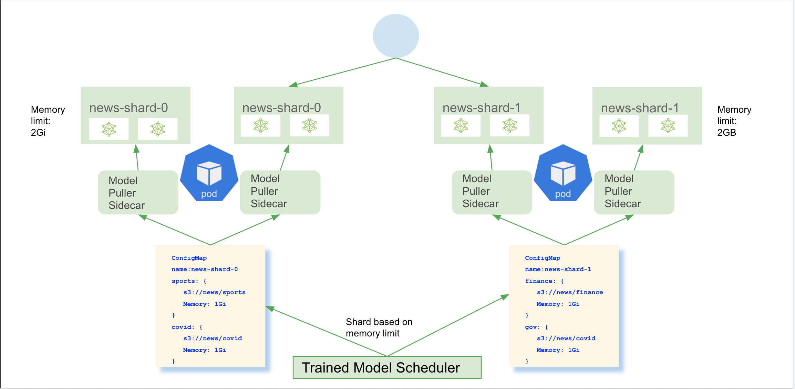

# Multi-Model Serving
## Introduction

### Problem

With machine learning approaches becoming more widely adopted in organizations, there is a trend to deploy many models. More models aims to provide personalized experience which often need to train a lot of models. Additionally, many models help to isolate each user’s data and train models separately for data privacy.
When KFServing was originally designed, it followed the one model and one server paradigm which presents a challenge for the Kubernetes cluster when users want to deploy many models.
For example, Kubernetes sets a default limit of 110 pods per node. A 100 nodes cluster can host at most 11,000 pods, which is often not enough.
Additionally, there is no easy way to request a fraction of GPU in Kubernetes infrastructure, it makes sense to load multiple models in one model server to share GPU resources. KFServing's multi-model serving is a solution that allows for loading multiple models into a server while still keeping the out of the box serverless features.

### Benefits
- Allow multiple models to share the same GPU
- Increase the total number of models that can be deployed in a cluster
- Reduced model deployment resource overhead
    - An InferenceService needs some CPU and overhead for each replica
    - Loading multiple models in one inferenceService is more resource efficient
    - Allow deploying hundreds of thousands of models with ease and monitoring deployed trained models at scale

### Design

### Integration with model servers
Multi-model serving will work with any model server that implements KFServing V2 protocol. More specifically, if the model server implements the load and unload endpoint then it can use KFServing's TrainedModel.
Currently, the only supported model servers are Triton, SKLearn, and XGBoost. Click on [Triton](https://github.com/kubeflow/kfserving/tree/master/docs/samples/v1beta1/triton/multimodel) or [SKLearn](https://github.com/kubeflow/kfserving/tree/master/docs/samples/v1beta1/sklearn/multimodel) to see examples on how to run multi-model serving!

For a more in depth details checkout this [document](https://docs.google.com/document/d/11qETyR--oOIquQke-DCaLsZY75vT1hRu21PesSUDy7o).